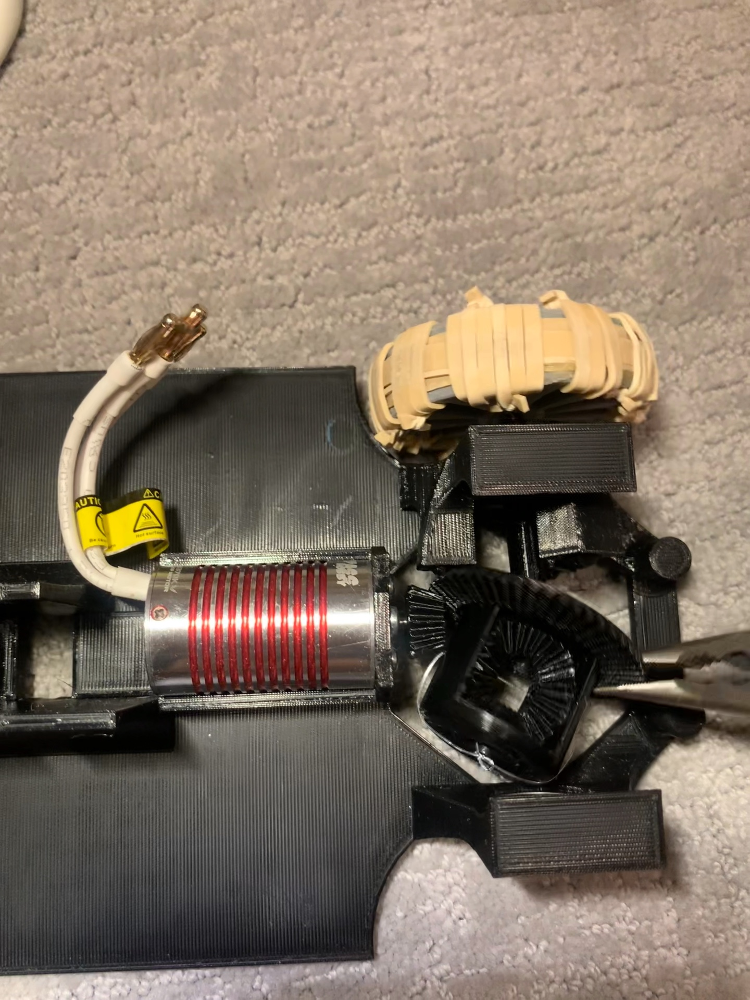
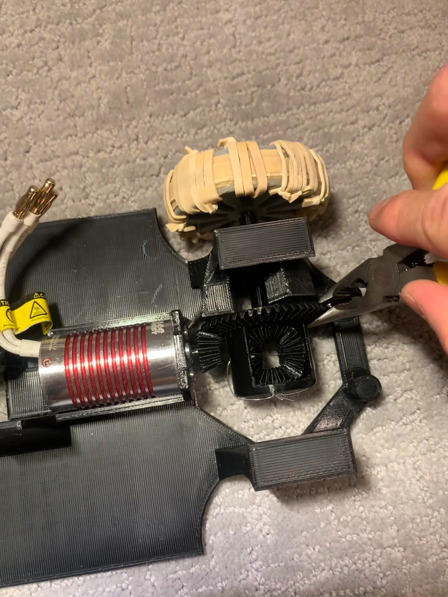

# Structure Assembly Guide

## Chassis and Mechanical Assembly

### Step 1: Insert the Castor Balls and Bearings
Insert the 3 castor balls into the rear wheel castor ball slots, then insert the 2 bearings into their respective slots.

    

### Step 2: Secure the Motor
Lock the motor into its place with M3 screws. Ensure the screws are firmly tightened, as vibrations from the motor can loosen the screws over time.

    

### Step 3: Install the Pinion Gear
Use a bar or F-clamp to press the pinion gear onto the motor shaft. The interference fit requires significant force to install. Make sure the top of the pinion gear aligns with the middle of the side castor ball.

    
    

### Step 4: Insert the Right Rear Wheel Axle
Insert the right rear wheel axle into its designated slot.

    

### Step 5: Assemble the Differential Gearbox
1. Assemble the differential gearbox.
2. Fasten the 2 case gears into the gearbox using the fishing line that runs through both of them. Tie a double knot on top of the gearbox.

   

       
   

3. Insert the 2 axle gears simultaneously, placing each on opposite sides of the gearbox first, then pushing them into place. Look down from the top of the gearbox to see if the axle gears are properly aligned (you should be able to see through the axle slots).

   

       
       
   

### Step 6: Position the Gearbox
Slide the gearbox at an angle between the right axle and the pinion gear to fix it in place.

    
    

### Step 7: Insert the Left Axle
Insert the left axle and fix the gearbox in its axis.

    

### Step 8: Attach the Wheels
Insert the wheels onto the axles.

### Step 9: Secure Wheels with Glue
Use a glue gun to secure the wheels to the axles. The interference fit provides most of the hold, but the glue is an extra measure.

### Steering Assembly

### Step 10: Install the Steering Rack
Insert the steering rack into its designated slot.

### Step 11: Attach the Steering Pinion
Use a glue gun to attach the steering pinion to the servo horn. Then attach the pinion gear to the servo and insert the servo into its place.

    
    

### Step 12: Assemble the Front Wheels and Knuckles
1. Use super glue or a glue gun to attach the bearings to the front wheels.
2. Attach the steering knuckles to the bearings.

### Step 13: Install Steering Knuckles
Insert the knuckles into their slots and cover them with the steering knuckle covers. Use at least 2 rubber bands to keep the covers in place. The rubber bands will also act as a suspension. Tie the rubber bands on the bottom side.

    

### Step 14: Connect the Steering Tie Rod
Use the steering tie rod to connect the steering rack to the steering knuckles.

### Step 15: Place Electronics
Double-sided tape the ESC, breadboard, and buck converter. Lay the ESC on the left side of the chassis, the breadboard, and the buck converter on the right side.

### Step 16: Follow Electronics Setup
Follow the steps detailed in the [Electronics Setup Guide](../../Electronics/README.md).

### Step 17: Attach Bumpers
Insert the front and rear bumpers into their designated slots. No glue is needed as they fit securely with interference fit.
