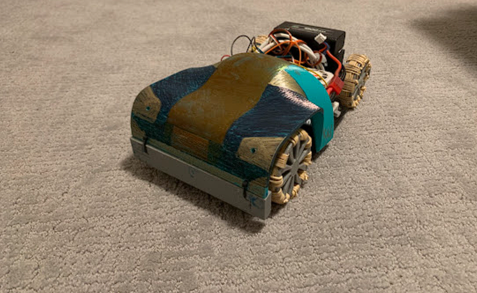
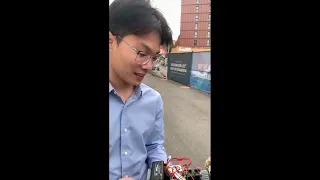
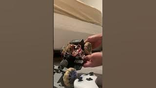

# Psychic-Engine: 3D-Printed RC Car Project

## Table of Contents

1. [Introduction](#1-introduction)
2. [Goals](#2-goals)
3. [Features](#3-features)
4. [Technologies Used](#4-technologies-used)
5. [Project Structure](#5-project-structure)
6. [Getting Started](#6-getting-started)
   - [Prerequisites](#61-prerequisites)
   - [Steps](#62-steps)
   - [Demo Videos](#63-demo-videos)
7. [Challenges and Solutions](#7-challenges-and-solutions)
   - [Electronics](#71-electronics)
   - [Rear Differential Drive](#72-rear-differential-drive)
   - [Steering System](#73-steering-system)
8. [Future Improvements](#8-future-improvements)
9. [License](#9-license)
10. [Acknowledgments](#10-acknowledgments)
11. [Contact](#11-contact)

    

## 1. Introduction
This project involves the design, 3D printing, and assembly of a fully functional RC car, controlled by an ESP32 microcontroller. The car features a custom-designed rear differential and a rack-and-pinion steering system based on the Ackerman principle to avoid skidding. All parts are custom-designed, with the exception of a few metal machined parts where higher durability and precision were required.

## 2. Goals

The primary goals of the Psychic-Engine 3D-Printed RC Car Project are to:

1. **Develop a Fully Functional 3D-Printed RC Car**: Design, 3D print, and assemble a reliable and robust RC car using custom-designed parts, ensuring all components fit seamlessly together and perform as intended.

2. **Implement Efficient Control Using ESP32**: Utilize the ESP32 microcontroller to achieve efficient and responsive wireless control of the car.

3. **Incorporate Advanced Steering Mechanisms**: Implement a rack-and-pinion steering system based on the Ackerman principle to improve cornering performance.

4. **Ensure Effective Power Distribution**: Create a custom rear differential that provides balanced power distribution to the wheels.

5. **Facilitate Easy Assembly**: Use snap-fit joints and compliant mechanisms to simplify assembly, reducing the need for machined fasteners.

6. **Prepare for Autonomous Features**: Lay the groundwork for autonomous navigation capabilities by planning for the integration of sensors and control systems.

These goals are designed to guide the project towards developing a versatile and innovative RC car that serves both as a functional prototype and an educational tool.

## 3. Features
1. **Custom 3D-Printed Parts**: Most components are designed in SolidWorks, 3D-printed using PLA and PETG materials.
2. **ESP32 Control**: The car is controlled using an ESP32 microcontroller, providing efficient wireless communication and processing power.
3. **Ackerman Steering System**: The rack-and-pinion steering follows the Ackerman principle to reduce tire wear and improve cornering performance.
4. **Rear Differential**: A custom-designed rear differential ensures smooth power distribution to the wheels, enhancing the car's handling.
5. **Snap Fit Joints**: Compliant mechanism is used to create snap fit joints, eliminating the need for machined fasteners.

## 4. Technologies Used
1. **CAD Software**: SolidWorks
2. **3D Printer**: Sovol SV06
3. **Materials**: PLA (Elegoo) for structural components, PETG (Overture) for functional parts
4. **Microcontroller**: ESP32
5. **Programming Language**: C++ (for Arduino/ESP32 script)

## 5. Project Structure
1. **[Structure](./Structure/)**
   - Contains the **[SolidWorks](./Structure/Solidworks/)** folder with all CAD files.
   - 3D printing instructions
   - Contains the **[Assembly_Instructions](./Structure/Assembly_Instructions/)** folder with detail images of assembly steps
2. **[Electronics](./Electronics/)**
   - Contains the **[Arduino](./Electronics/Arduino/)** folder with ESP32 scripts.
   - Setup instructions for the electronic components.

## 6. Getting Started

### 6.1 Prerequisites
1. SolidWorks (or any CAD software) installed for viewing and modifying CAD files.
2. Slicing software suitable for your printer.
3. Arduino IDE configured to work with ESP32 for uploading the script.
4. A Sovol SV06 3D printer (or any FDM printer) with a print plate size of at least 235x235 mm.

### 6.2 Steps

1. **3D Printing the Parts**:
   - Navigate to the **[Structure](./Structure/)** folder.
   - Follow the instructions provided in the 3D printing instructions file to prepare and print all the necessary components.

2. **Assembling the Car**:
   - Go to the **[Assembly_Instructions](./Structure/Assembly_Instructions/)** subfolder.
   - Follow the detailed assembly instructions provided to assemble the 3D-printed parts into the final RC car structure.

3. **Setting Up Electronics**:
   - Navigate to the **[Electronics](./Electronics/)** folder.
   - Follow the instructions provided to connect the Xbox controller to the ESP32 microcontroller.
   - Refer to the motor/servo wiring instructions to correctly wire the motor and servo to the ESP32.

### 6.3 Demo Videos

## 7. Challenges and Solutions

The development of the RC car was segmented into three primary components: electronics, rear differential drive, and steering. Each component presented distinct challenges that required tailored engineering solutions.

### 7.1 Electronics
1. **Challenge**: Difficulty in establishing a Bluetooth Low Energy (BLE) connection between the Xbox controller and the ESP32 microcontroller.
   - **Solution**: After conducting extensive research, the Bluepad library was identified and utilized. This library provided the necessary support for BLE connections, enabling seamless communication between the Xbox controller and the ESP32.

2. **Challenge**: Arming the motor via the Xbox controller and ESP32 was problematic due to the absence of a conventional radio controller.
   - **Solution**: A script found on the [Arduino forum](https://forum.arduino.cc/t/lessons-on-arming-esc-with-arduino/427152) facilitated the identification of the correct arming PWM signals for the ESC. Implementing this script allowed for successful motor arming and control.

### 7.2 Rear Differential Drive
1. **Challenge**: The gearbox experienced displacement from the pinion gear during operation, compromising gear engagement and overall performance.
   - **Solution**: A structural enhancement was made by designing a three-arm system that extends from the chassis to apply pressure on the gearbox, maintaining optimal engagement with the pinion gear. Castor balls were integrated at the arm ends to minimize friction, facilitating smooth high-speed rotation of the ring gear.

2. **Challenge**: High stress concentrations led to frequent axle breakage.
   - **Solution**: Structural integrity was improved by introducing fillets at critical stress points behind the wheel and axle gear, promoting even stress distribution. Additionally, the infill percentage was increased, and a triangular infill pattern was adopted to enhance the axle's durability.

### 7.3 Steering System
1. **Challenge**: Determining the precise length of the steering tie rod was complex, resulting in difficulties in maintaining the steering wheels' alignment.
   - **Solution**: SolidWorks was employed to assemble the steering rack and knuckles in a virtual environment. This facilitated accurate determination of the tie rod length, ensuring consistent and correct alignment of the steering wheels.

2. **Challenge**: The tie rod had a propensity to become misaligned and rotate inwards, risking damage to the servo by causing it to lock or break during excessive rack movement.
   - **Solution**: To mitigate this issue, two structural poles were added to the chassis, acting as physical stops. These stops prevent excessive inward rotation of the tie rods, thereby safeguarding the servo from potential damage.

### Summary

By methodically addressing each engineering challenge, the RC car project achieved a robust and reliable design. The implemented solutions not only resolved the specific issues but also enhanced the car's overall performance and structural integrity, ensuring its capability to withstand various operating conditions.

## 8. Future Improvements

Looking forward, several enhancements are planned to elevate the functionality and user experience of the RC car:

1. **Integrating an IMU and OpenPilot**: To enable autonomous navigation capabilities, the integration of an Inertial Measurement Unit (IMU) along with the [OpenPilot](https://github.com/commaai/openpilot.git) system is proposed. This will allow the car to navigate and maneuver independently based on pre-defined parameters and real-time sensor data.

2. **Adding a First-Person Camera with Microphone**: To enhance the user experience and expand the car's applications, a first-person view (FPV) camera will be installed alongside a microphone to capture ambient sounds. This setup will enable the car to be used for inspections and monitoring in various settings such as factories, construction sites, or natural environments, providing both visual and auditory feedback.

3. **Transitioning to Radio Signal Control**: To extend the operational range and reliability of the control system, the project plans to transition from Bluetooth to radio signal-based control. This shift will allow for longer-range operation and a more stable connection, improving the car’s performance in various environments.

4. **Solar-Powered Charging System**: Integrating solar panels into the car's design is planned to provide an additional power source. This could supplement the battery or allow for continuous operation in sunny conditions, increasing the car's autonomy and reducing the need for frequent battery charging.

## 9. License
- The ESP32 script is licensed under the MIT License.
- The SolidWorks design files are licensed under the Creative Commons Attribution 4.0 International License.

## 10. Acknowledgments
- Special thanks to Brendon Kennard for providing the BLDC motor for this project.
- Thanks to [Bluepad32](https://github.com/ricardoquesada/bluepad32.git) for the initial ESP32 code framework.
- Thanks to [The Engineering Mindset](https://youtu.be/vpbhvxAM0io?si=aknrSyXhpb9AykjJ) for inspiring the modelling of the differntial gearbox model.

## 11. Contact
If you have any questions or want to collaborate, feel free to reach out to me at trungkhang1110@gmail.com.
